# README

## Drumrust - A marketplace for used music products

### What is the problem I am trying to solve?

I am trying to create marketplace that can provide a platform tailored towards the community of Australian musicians and music hobbyists. This platform will allow for a strong line of communication between buyers and sellers of used music equipment and accessories. I believe there is room for a disruptor within this market, as there are not any significant spaces for used instrument resale that also provide direct communication between individuals, whether it be for discussion for the purpose of business or entertainment. I want to provide all of this, as well as streamline and modernise the resale process for users by providing stronger yet simpler tools compared to other Australian marketplaces targeting the music industry.  

### Why is it a problem that needs solving?

As a hobbyist musician, and a fan of seeking musical instruments at affordable prices, I have found through personal research that there is a distinct lack of Australian based, used music equipment marketplaces that can be considered modern or user friendly. The majority of these resale websites have outdated design choices, unnecessary UI and UX complications, and little to no efficient and modern choices regarding streamlined user to user interaction. I believe that a focus on these interactions would be beneficial in many ways. Within the music industry, it is known that the majority of people believe that the best experience when buying musical instruments is to be in a physical store, where the instrument can be felt and played before purchase. To make sure an online marketplace can mimic this experience as closely as possible considering the constraints, a music resale marketplace must provide its users with tools that allow for a strong and open line of communication between buyers and sellers. I also believe that a community must be formed in order to stand out from other resale marketplaces, as broader resale marketplaces such a Gumtree or eBay don't cater towards a specific audience. I believe that targeting a specific audience of musicians or hobbyists, along with providing tools for open communication between users is the key to create a swiftly growing community with a devoted user-base.

### Heroku Link

[https://morning-bayou-60602.herokuapp.com/](https://morning-bayou-60602.herokuapp.com/)

### Github Repository Link

[https://github.com/OldsterJoey/drumrust]

### Application Description

#### Purpose

Provide a resale platform for Australian musicians and music hobbyists and form a disruptor within this market by providing strong community tools and a streamlined resale process or both buyers and sellers.

#### Functionality/Features

-   User authentication with customisable profile pages developed through the use of the Devise ruby gem.
    
-   Authorisation to allow users to take control of their own personal profiles, products and transactions
    
-   Streamlined products listing page with easy to understand category filtering capability
    
-   Search bar to query specific products as required
    
-   Product payment through the use of online payment processing tool, Stripe, along with view-able receipt and payment success notice
    
-   Image upload capability through the use of an external Amazon S3 bucket

#### Features planned for near future implementation

-   Comments section under all products, controlled by the seller
    
-   Instant messaging capability between users
    
-   Automatic receipt emails
    
-   User registration email verification
    
-   Expanded categories and sorting capability
    
-   Area maps for product location tracking
    
-   Meet up system for users to discuss meeting publicly for product examination upon request
    
-   Hide-able address tracking system for users or stores
    
-   Watch list for each user to track products

#### Sitemap

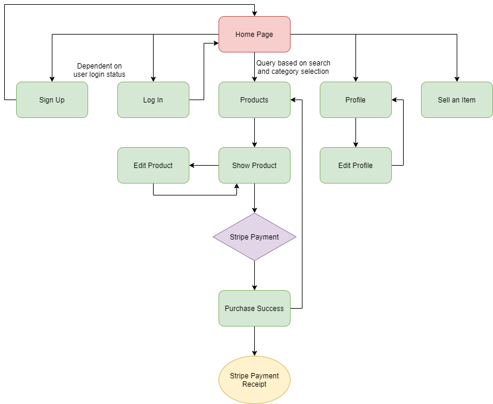
  
#### Screenshots

 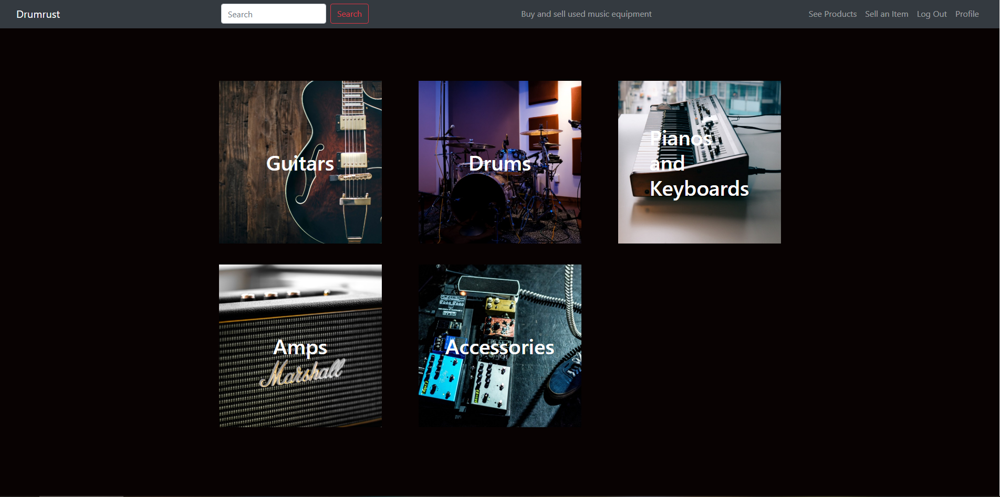
 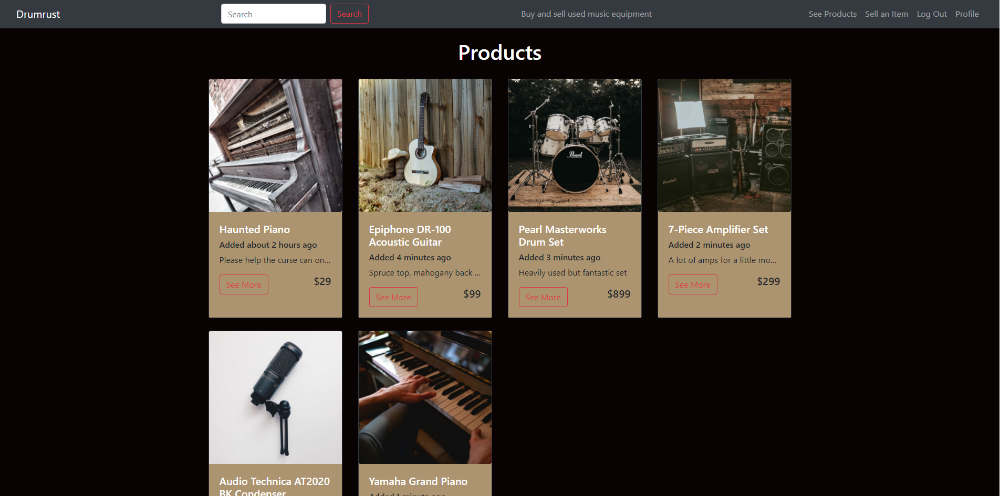
 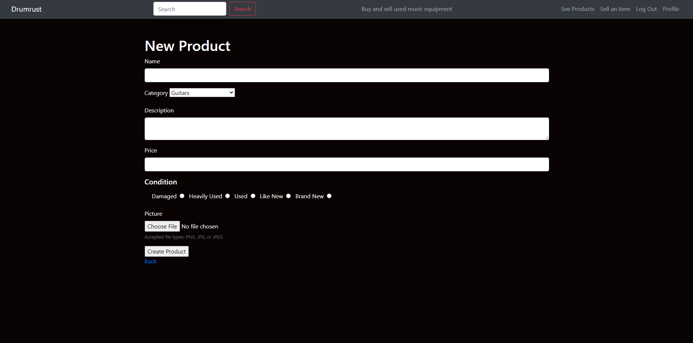
 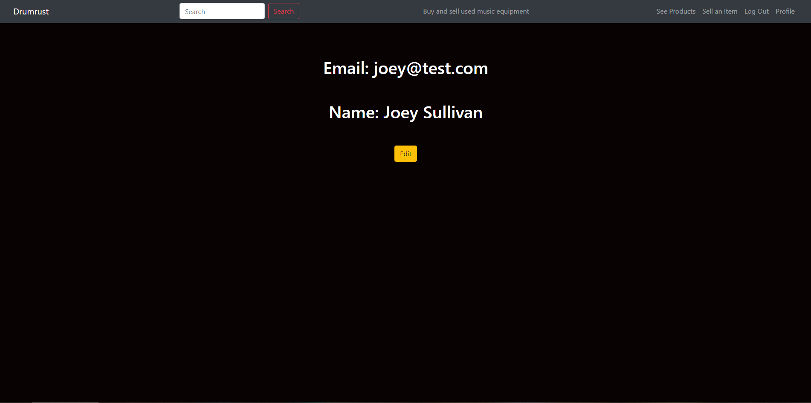
  

#### Target audience

Specifically targeted towards musicians and music hobbyists within Australia

#### Tech Stack

  

-   HTML
    
-   SCSS
    
-   Bootstrap
    
-   Ruby
    
-   Ruby on Rails
    
-   PostgreSQL
    
-   Javascript
    
-   Heroku
    
-   Stripe
    
-   Amazon AWS S3

#### User Stories

-   As a musician, I want a platform where I can buy or sell instruments from other musicians
    
-   As a music hobbyist, I want a place to go to discuss instruments with other like minded people
    
-   As a seller of used music equipment, I want a place where I can easily provide my products to a community looking for it
    
-   As a buyer of used music equipment, I want to be able to find the product I am looking for efficiently so that I can simplify my buying process
    
-   As a music fan, I want a platform where I can discuss instruments and accessories with other music fans
    
-   As a person experienced in product resale, I want an experience that is streamlined to my liking so that I can provide or buy products easier

#### Wireframes

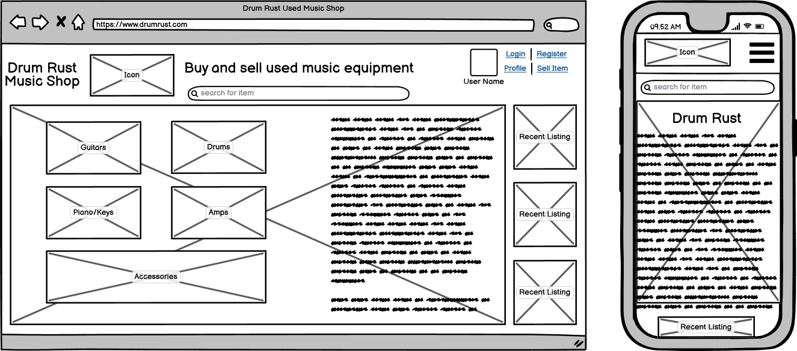
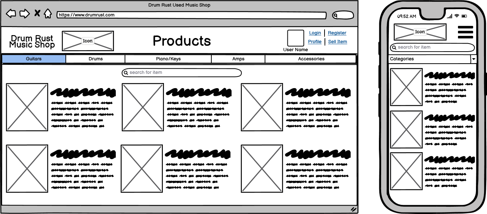
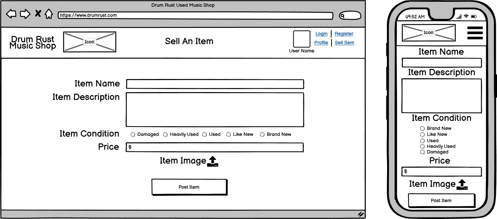
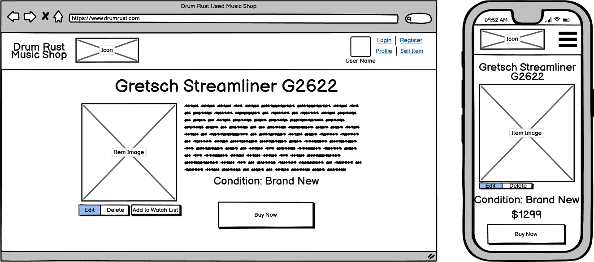
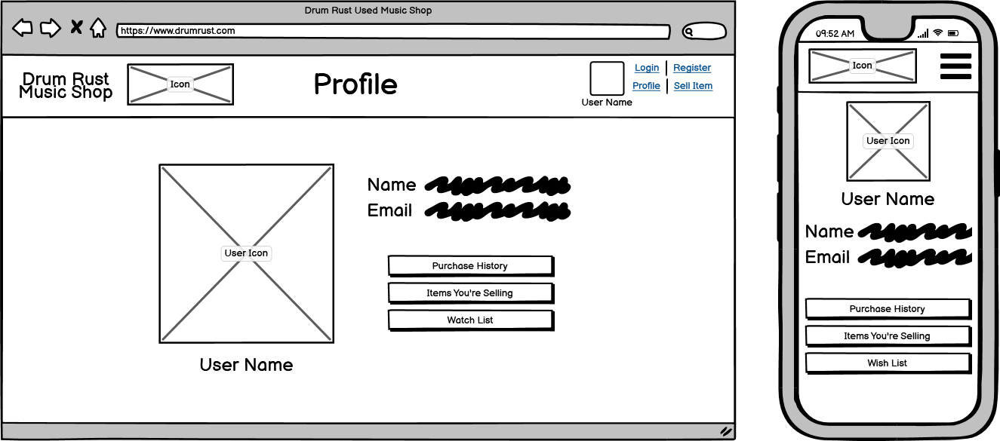

#### Entity Relational Diagram

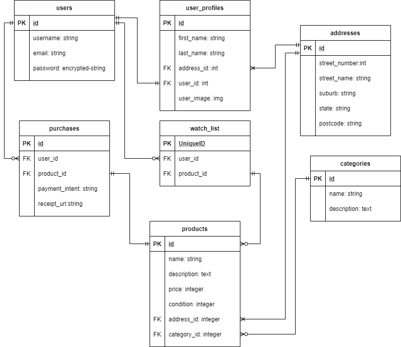

#### High-level components

Drumrust utilises the Model View Controller design pattern befitting the chosen framework of Ruby on Rails, with the views providing the front end html for the website, the controllers providing ruby code methods to alter and create high level functions, and the model providing database information and active record associations between data tables. The chosen database service for this application is PostgreSQL, a relational database management system utilising the SQL programming language. Model generation and active record association provides tools for efficient database alteration and creation, without the need for manually injecting data using the SQL programming language.

#### Third Party Services

Devise is used to streamline the process of creating a user authentication system by providing an advanced structure along with pre-built pages that are modifiable under the MVC design pattern. Amazon AWS S3 services provide the application with an external storage server, called a bucket, for user uploaded images in order to exponentially decrease the required room within the applications data, and allow for inexpensive deployment of the website through the Heroku deployment platform. Stripe is the payment processing software utilised within the Drumrust marketplace app. Connecting to an external stripe account through the use of ultrahook webhooks allow for a streamlined payment system with little requirements within the source code.

#### Model Relationships and Database Relations

-   User Model - The user model holds user information through devise. In terms of relationships, multiple products can be linked to a single user, and each user has as user profile in a one-to-one relationship.
    
-   Product Model - The product model holds information on each and every listed product within the applications database. Each product belongs to a single category within the category model, along with a single user. Upon purchase, this model belongs to the purchase model.
    
-   Purchase Model - The purchase model applies specifically upon purchase of a product by a user. As such, the purchase model belongs to both a single product and a single user.
    
-   Address Model - A single address belongs to a single user, and can belong to multiple products from that particular user.
    
-   Watchlist Model - All users within the user model have a single watchlist that can hold as many products as requested from the products table.
    
-   Category Model - A table of multiple categories, with a single category within this table belonging to a single product.
    
-   User-Profile Model - Simple model with no relationships outside of belonging to a single user within the user model.

#### Database Schema Design

Database schema design information is located within the comments of schema.rb within the source code
 

#### Task Allocation and Tracking Method

All required tasks for the development of this application were tracked using the Trello online tool for tracking tasks in a work environment.

Link: [https://trello.com/b/QMXDQ2Ip/drumrust-marketplace](https://trello.com/b/QMXDQ2Ip/drumrust-marketplace)

#### Trello Screenshots

Early Development

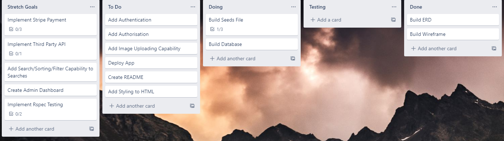

Mid Stage Development

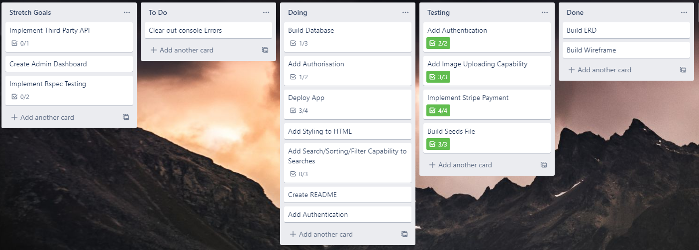

Late Development

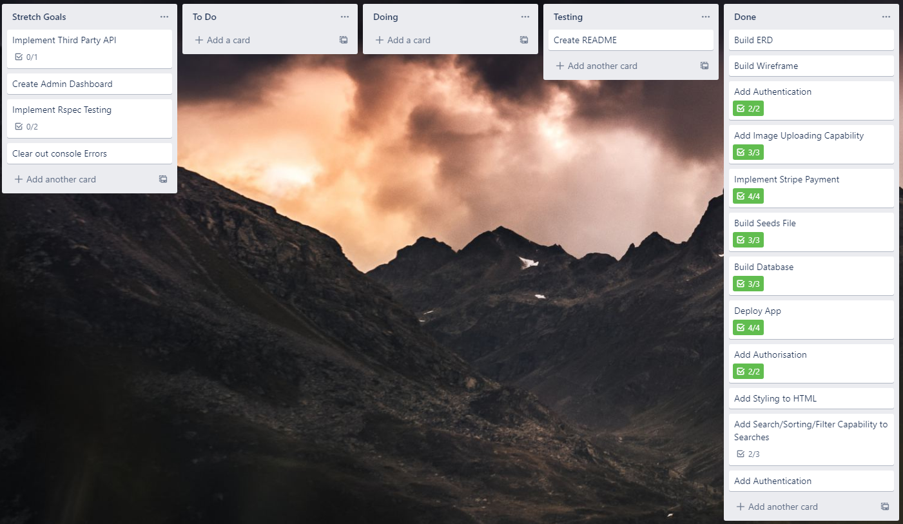
